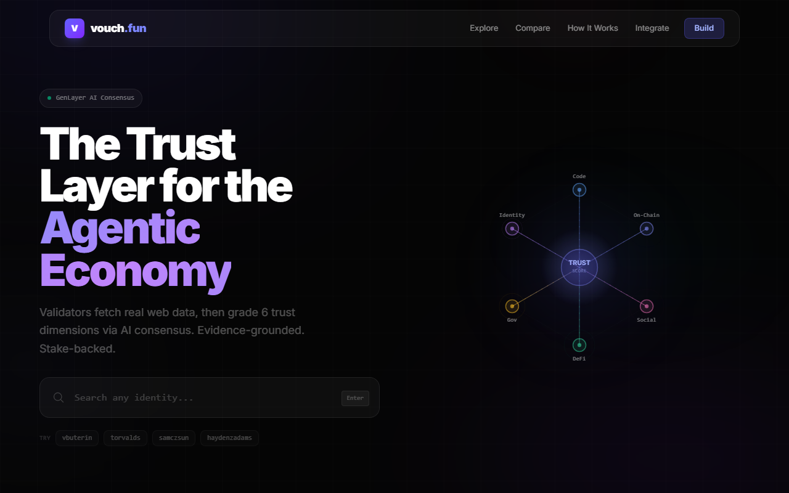
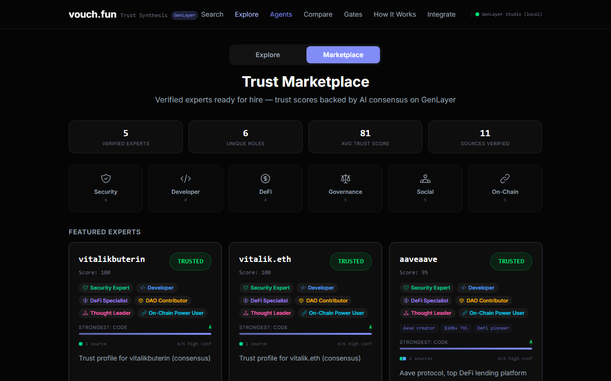
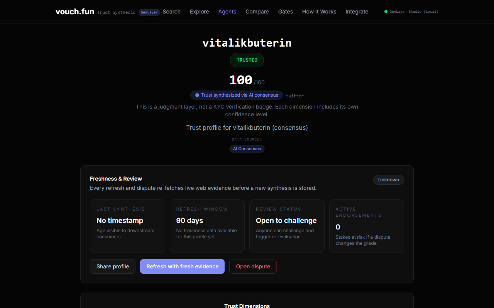

# vouch.fun

[](https://github.com/Ridwannurudeen/vouch-fun/actions/workflows/ci.yml)
[](LICENSE)
[](https://vouch.gudman.xyz)
[](https://genlayer.com)

Composable reputation oracle for the agentic economy. 5 AI validators fetch real data from GitHub, Etherscan, and ENS, then grade 6 trust dimensions through GenLayer's Equivalence Principle.

<p align="center">
  
</p>

<p align="center">
  <a href="https://vouch.gudman.xyz"><strong>Live App</strong></a> &middot;
  <a href="https://vouch.gudman.xyz/explore?view=marketplace">Marketplace</a> &middot;
  <a href="docs/API_REFERENCE.md">API Docs</a>
</p>

---

## Problem

An agent needs to answer **"Can I trust this entity?"** before hiring, lending, or delegating. Today trust is binary (KYC or nothing) and siloed — GitHub doesn't talk to on-chain doesn't talk to social. There's no composable, machine-readable reputation layer for smart contracts to query.

## Solution

vouch.fun synthesizes a 6-dimension trust profile from scattered web2/web3 signals, stores it on-chain, and exposes it as a composable oracle any contract can query:

```python
tier  = vouch.get_trust_tier(address)            # "TRUSTED" / "MODERATE" / "LOW"
grade = vouch.get_dimension(address, "code")     # {"grade": "A", "confidence": "high", ...}
score = vouch.get_trust_score(address)            # 0-100
```

---

## Features

- **6-Dimension Trust Scoring** — Code, On-Chain, Social, Governance, DeFi, Identity
- **AI Consensus** — 5 independent validators grade each dimension via Equivalence Principle
- **Trust Marketplace** — browse verified experts by role, filter by dimension grade
- **TrustGate Composability** — any contract gates actions on specific trust dimensions
- **Trust Oracle API** — `trust_query()` and `trust_batch_query()` for protocol integrations
- **Stake-to-Vouch** — skin-in-the-game endorsements with dispute slashing
- **Profile Comparison** — side-by-side 6-axis radar comparison of any two profiles
- **Python SDK** — one-liner trust checks for contract and backend integration

### Trust Marketplace

Browse verified experts by role category. Filter by dimension grade, sort by relevance.

<p align="center">
  
</p>

### Trust Profile

Each profile shows trust score, tier, 6 dimension grades, data sources, freshness, and dispute status.

<p align="center">
  
</p>

---

## The 6 Trust Dimensions

| Dimension | Key | What AI Evaluates |
|-----------|-----|-------------------|
| Code Activity | `code` | Repos, commits, languages, stars, OSS impact |
| On-Chain Activity | `onchain` | Tx history, account age, contracts deployed |
| Social Presence | `social` | Twitter/X influence, content quality, reach |
| Governance | `governance` | DAO participation, proposals, voting history |
| DeFi Behavior | `defi` | Protocol interactions, LP history, risk appetite |
| Identity | `identity` | ENS, Lens, Farcaster, cross-platform linkage |

Each dimension returns a **grade** (A–F), **confidence** (high/medium/low), **reasoning**, and **key signals**.

---

## Architecture

```
  Identifier Input              AI Consensus                    On-Chain Profile
  +-----------------+     +-------------------------+     +---------------------+
  | GitHub: vbuterin|     |   Validator 1 (LLM A)   |     | code:    A (high)   |
  | ENS: vitalik.eth| --> |   Validator 2 (LLM B)   | --> | onchain: A (high)   |
  | Wallet: 0xd8dA..|     |   Validator 3 (LLM C)   |     | social:  A (high)   |
  | Twitter: @vitalik|    |   Validator 4 (LLM D)   |     | governance: B (high)|
  +-----------------+     |   Validator 5 (LLM E)   |     | defi:    B (medium) |
                          +-------------------------+     | score: 91 / TRUSTED |
                                    |                      +---------------------+
                                    v                              |
                          +-------------------------+     +--------+--------+
                          | Equivalence Principle   |     |                 |
                          | Subjective consensus    |  Frontend      Consumer Contracts
                          +-------------------------+  (marketplace)  (TrustGate, Lending,
                                                                      AgentMarketplace)
```

---

## Getting Started

### Prerequisites

- Node.js 18+
- Python 3.10+ (for contract deployment and SDK)
- A GenLayer Bradbury testnet account with GEN tokens

### Installation

```bash
git clone https://github.com/Ridwannurudeen/vouch-fun.git
cd vouch-fun
```

### Frontend

```bash
cd frontend
npm install
cp .env.example .env    # set VITE_CONTRACT_ADDRESS
npm run dev             # http://localhost:5173
```

### Deploy Contracts

```bash
# Requires Bradbury testnet private key with GEN
DEPLOY_KEY=0x... node scripts/deploy_v3.mjs
```

### Run Tests

```bash
python -m pytest tests/ -v
```

---

## Usage

### Composable Trust Checks

Any GenLayer contract can gate actions on specific trust dimensions:

```python
# Gate registration by code quality
grade = vouch.get_dimension(caller, "code")
if grade < min_grade:
    raise Exception("Insufficient trust")

# Scale borrow limits by trust score
score = vouch.get_trust_score(caller)
# TRUSTED: 10K @ 2% | MODERATE: 5K @ 5%

# Trust-gated hiring
post_job("Audit my contract", "Full audit", "code", "B")  # Only B+ can bid
```

### Python SDK

```python
from vouch import VouchClient

client = VouchClient("0x69690E34f49F29344A393707FF5f364eFc40B0A1")
if client.is_trusted(addr):
    proceed()
if client.meets_threshold(addr, "code", "B"):
    hire()
```

Full API reference: [docs/API_REFERENCE.md](docs/API_REFERENCE.md)

---

## Project Structure

```
vouch-fun/
├── contracts/
│   ├── vouch_protocol.py        # Core: 6-dimension AI trust synthesis
│   ├── trust_gate.py            # Consumer: dimension-gated registration
│   ├── trust_lending.py         # Consumer: borrow limits by trust score
│   └── agent_marketplace.py     # Consumer: trust-gated agent hiring
├── sdk/
│   └── vouch.py                 # Python SDK
├── frontend/src/
│   ├── pages/
│   │   ├── Home.tsx             # Landing + vouch-yourself flow
│   │   ├── Explore.tsx          # Marketplace + explore grid
│   │   ├── Profile.tsx          # 6-axis radar, confidence, disputes
│   │   └── Compare.tsx          # Side-by-side comparison
│   ├── components/              # RadarChart, ProfileCard, ConsensusAnimation, etc.
│   └── lib/
│       └── genlayer.ts          # Contract client + cache layer
├── scripts/                     # Deploy scripts
├── tests/                       # Schema validation + helpers
└── docs/
    └── API_REFERENCE.md         # Full contract API + economics
```

---

## Tech Stack

| Layer | Technology |
|-------|------------|
| Smart Contracts | Python Intelligent Contracts (GenLayer Bradbury) |
| Consensus | Optimistic Democracy + Equivalence Principle |
| AI Evaluation | `gl.nondet.exec_prompt()` — 5 independent validators |
| Data Fetching | `gl.nondet.web.render()` — GitHub API, Etherscan, ENS |
| Frontend | React 19 + TypeScript + Vite + Tailwind CSS 4 |
| Visualization | Recharts (6-axis radar) + Framer Motion |
| SDK | genlayer-js 0.28.2 |

---

## Deployed Contracts

| Contract | Address | Network |
|----------|---------|---------|
| VouchProtocol v4 | `0x69690E34f49F29344A393707FF5f364eFc40B0A1` | Bradbury Testnet |

---

## Economics

| Mechanism | Amount | Purpose |
|-----------|--------|---------|
| Query Fee | 1000 wei per vouch/refresh | Protocol revenue |
| Stake-to-Vouch | 5000 wei minimum | Skin-in-the-game endorsement |
| Dispute Slashing | Staked amount | Wrong stakers lose their stake |

Profiles expire after 90 days — `refresh()` creates recurring revenue.

---

## Why GenLayer

vouch.fun requires **subjective AI consensus** — 5 validators independently evaluating the same person must agree on "equivalent" assessments, not identical ones. This is impossible on deterministic chains and impractical with single-oracle setups.

| Requirement | Traditional Chains | GenLayer |
|------------|-------------------|----------|
| Independent AI evaluation | 1 LLM, no verification | 5 validators, outlier filtering |
| Subjective consensus | Impossible (deterministic) | Equivalence Principle |
| Native composability | Oracle adapter contracts | `gl.ContractAt()` direct calls |
| Dispute resolution | Custom implementation | Built-in optimistic democracy |

---

## Competitive Landscape

| Protocol | Dimensions | Output | On-Chain Composable | AI Consensus |
|----------|-----------|--------|---------------------|--------------|
| Gitcoin Passport | 1 | Boolean | Limited | No |
| DegenScore | 1 | Score | No | No |
| Worldcoin | 1 | Boolean | No | No |
| **vouch.fun** | **6** | **Graded + reasoned** | **Yes** | **5 validators** |

---

## Roadmap

- **v4 (current)** — 6-dimension trust synthesis, 3 consumer contracts, marketplace, Python SDK, stake-to-vouch
- **v5** — 90-day profile decay + paid refresh loop (recurring revenue)
- **v6** — GenLayer mainnet, vouch bonds, slashing, consumer contract ecosystem

---

## Contributing

Contributions are welcome. Please open an issue first to discuss what you'd like to change.

1. Fork the repository
2. Create your branch (`git checkout -b feat/your-feature`)
3. Commit your changes
4. Push to the branch (`git push origin feat/your-feature`)
5. Open a Pull Request

---

## License

[MIT](LICENSE)
